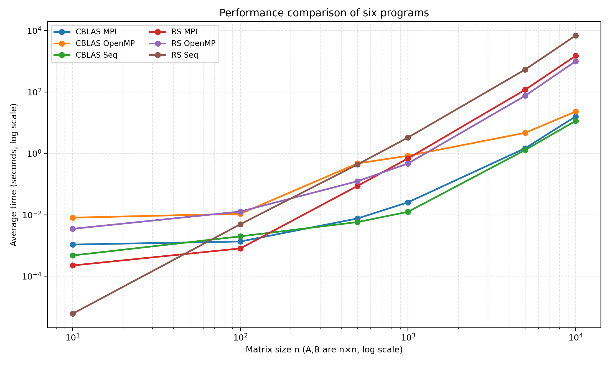
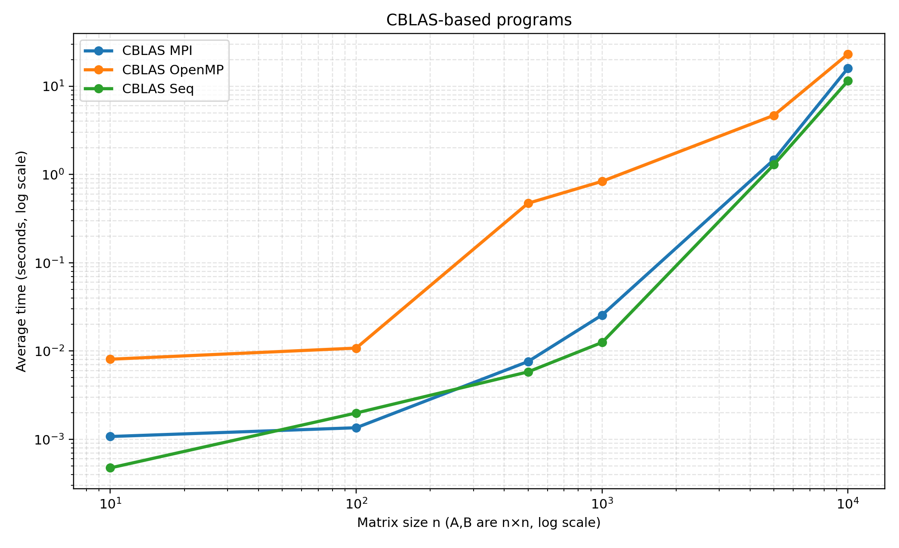
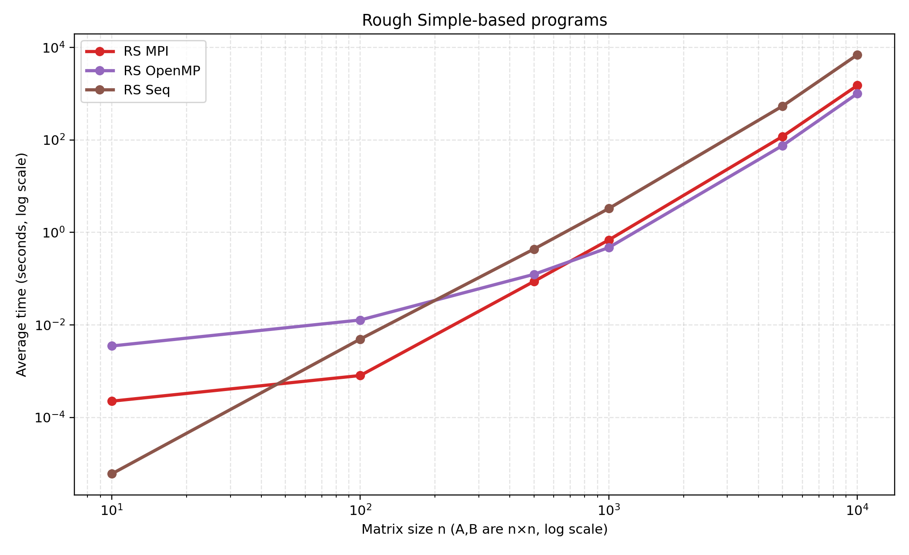
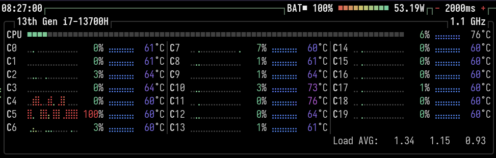
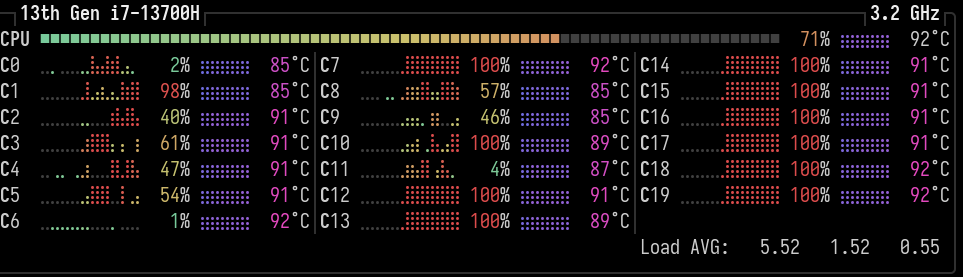
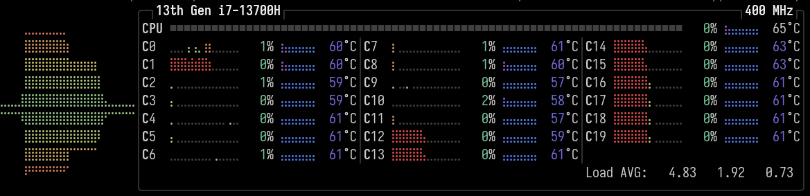
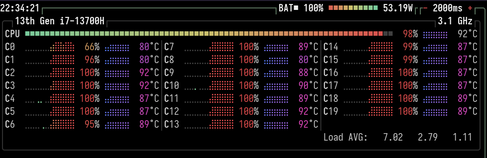
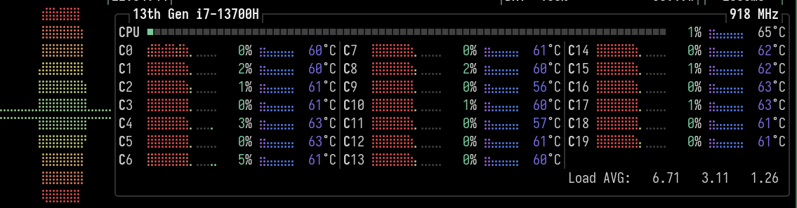

# 上机实验报告：MPI/openMP 并行计算矩阵乘法

王志超 23343062 2026年4月16日
- [上机实验报告：MPI/openMP 并行计算矩阵乘法](#上机实验报告mpiopenmp-并行计算矩阵乘法)
  - [实践内容介绍](#实践内容介绍)
  - [上机结果与讨论](#上机结果与讨论)
    - [算法原理](#算法原理)
    - [程序实例使用说明](#程序实例使用说明)
      - [性能测试程序](#性能测试程序)
      - [综合性展示程序](#综合性展示程序)
    - [性能测试——不同算法在不同矩阵规模下的性能对比](#性能测试不同算法在不同矩阵规模下的性能对比)
      - [CBLAS 系列算法](#cblas-系列算法)
      - [Rough Simple (手写串行) 系列算法](#rough-simple-手写串行-系列算法)
      - [综合分析](#综合分析)
    - [性能测试——不同节点数量下MPI运行速度](#性能测试不同节点数量下mpi运行速度)

## 实践内容介绍
利用MPI(openMP)进行矩阵乘以矩阵加速计算，对比(自己写的)串行和MPI(openMP)并行运行时间。并跟cblas库里dgemm(python里用NumPy或SciPy类似功能函数)串行计算进行比对。
## 上机结果与讨论
### 算法原理
计算式 $A \cdot B = C$

MPI实现采用最简单的分批计算的方法
- 对所有进程进行集体通信，从主节点(rank=0)将B矩阵广播
- 主进程一次性将矩阵A进行分块，分发给所有工作进程
- 工作进程计算出各自分块结果，送回给主进程

openMP实现与MPI实现类似，区别在于openMP并行计算时不需要广播矩阵B或分发矩阵A。每个线程都共享同一块内存，可以直接访问矩阵A的不同部分进行计算，且每个线程计算完成后直接将结果写回矩阵C，没有收集结果的过程。

### 程序实例使用说明
#### 性能测试程序
项目根据并行方法分为MPI、openMP、和串行；而每个并行节点/线程的计算方法又分为原始手写串行和调用cblas库函数两种。根据不同的组合，项目有六个可执行文件以供性能测试，分别为：
- MM_cblas_mpi：MPI并行计算，工作节点计算采用cblas串行
- MM_cblas_openmp：openMP并行计算，工作线程计算采用cblas串行
- MM_cblas_seq：串行计算，计算采用cblas串行
- MM_RS_mpi：MPI并行计算，工作节点计算采用原始手写(RS即Rough Simple缩写)串行
- MM_RS_openmp：openMP并行计算，工作线程计算采用原始手写串行
- MM_RS_seq：串行计算，计算采用原始手写串行
#### 综合性展示程序
同时项目还具有一个综合性的可执行文件comprehensive_demo，用以展示不同算法的性能对比，由于openMP并行计算原理与实现方法较为简单，该可执行文件仅包含MPI并行计算的性能对比。根据宏定义的实现细节，comprehensive_demo有多个编译可选项(可在CMakeLists.txt的target_compile_options()自定义配置宏进行调整)：
- NON_BLOCKING_COMMUNICATION——主节点是否采用无阻塞通信：非串行分发/接收信息，而是一次性开启多个线程并行分发/接收信息
- MPI_COMPUTATION_USE_BLAS——工作节点计算的方法：原始手写串行或调用cblas_dgemm
- ADD_RSSEQ_COMPARE——是否加入原始手写串行对比：原始手写串行很慢，如果设置为加入对比注意调整矩阵维度以免耗费过多时间
- REPORT_DEBUG_INFO——MPI通信过程展示，用以调试和理解MPI通信过程

### 性能测试——不同算法在不同矩阵规模下的性能对比

测试时为简化不同矩阵大小的描述，令A与B矩阵维度为$N \times N$ （注意：矩阵的下标使用int类型标记，$N^2$若超过int类型最大值则需要调整）

下图给出了六个可执行文件在不同矩阵规模下的平均运行时间。为了同时观察小规模与大规模矩阵的变化趋势，横轴和纵轴都采用了对数坐标。

图1：六个程序总体性能对比

图2：CBLAS系列算法性能对比

图3：Rough Simple系列算法性能对比

从总体结果看，性能差异主要由两部分决定：一是每个节点/线程内部采用的是 CBLAS 还是手写三重循环，二是外层并行方式是 MPI 还是 OpenMP。六个程序的结果总结分析如下：

#### CBLAS 系列算法

CBLAS 系列算法在所有规模上都明显快于 Rough Simple 系列，说明底层 BLAS 实现对缓存、向量化（SIMD，单指令多数据）和块划分的优化非常有效。

CBLAS 系列内部对比时，串行版本始终最快，MPI 和 OpenMP 的外层并行反而引入了通信、调度和线程管理开销；在 $N=10000$ 时，CBLAS sequential 约为 11.48 s，CBLAS MPI 约为 15.98 s，CBLAS OpenMP 约为 23.09 s。本质上外层并行任务是通过充分利用计算资源，避免单线程读取内存数据时本可以进行的无关本段数据的计算被阻塞。当任务的浮点运算已经占据绝大部分时间，并且所有的核心都被用于运算，外层并行的收益就不明显了，反而通信和调度开销会影响运算性能。

#### Rough Simple (手写串行) 系列算法

小规模矩阵下，MPI 和 OpenMP 的额外开销更容易抵消并行收益，因此并行版本不一定比串行版本快；随着 $N$ 增大，计算量快速增长，并行收益才逐渐体现出来。

对于 Rough Simple 系列计算大型矩阵，OpenMP 和 MPI 都能明显优于纯串行实现，尤其在大规模矩阵下效果更明显；在 $N=10000$ 时，Rough Simple sequential 约为 6922.71 s，MPI 约为 1502.47 s，OpenMP 约为 1002.42 s。以下是更加细致的调查分析：
   
图4：手写串行算法运行时cpu负载的可视化

图4所示是通过btop对手写串行算法运行时cpu负载的可视化，可以看到手写串行算法运行时仅仅使用一个核心，而其他核心处于空闲状态；同时还可以看到进程在不同核心之间反复切换，当矩阵很大时，这样在核心之间切换上下文的开销是很大的。

图5：MPI并行算法运行时cpu负载的可视化

图6：MPI并行算法运行时cpu频率的可视化

图5所示是通过btop对MPI并行算法运行时cpu负载的可视化，可以看到MPI并行算法运行时多个核心都被充分利用。

但是也可以从图6所示的CPU频率波动图中看到，MRI并行算法随着运行时间增加，CPU总负载逐渐降低，大概率是手动分配的计算任务不均匀：
1. 对于N行矩阵，m个进程，当N不能被m整除时，每个进程分配到的行数有两种批次，一种是N/m行，另一种是N/m+1行；
2. 这导致cpu频率显著分为前后两段，前一段所有的进程都在计算，后一段已经算完N/m行的进程已经完成任务，而主进程仍然需要等待N/m+1行的进程完成任务。
3. 当N很大时，这种不均匀分配带来的性能问题就会逐渐显现出来。
4. 在实现MPI算法时为减少代码复杂度，没有给主节点安排计算任务，或许给主节点安排一部分计算任务可以有性能提升。

图7：openMP并行算法运行时cpu负载的可视化

图8：openMP并行算法运行时cpu频率的可视化

对比openMP并行算法的CPU频率波动图，相比于硬性对矩阵分块计算的MPI，openMP并行算法能够更好地平衡每个硬件核心的负载。
1. 推测openMP在并行运算过程中会动态调整每个线程的计算任务，避免了类似MPI由于手动分配任务不均匀带来的性能问题，线程之间共享内存，不存在互相不可见的数据，可以随时调整运算任务，这是openMP可以实现这点的原因。
2. 并且openMP并行算法不需要像MPI那样依赖主节点进行数据分发和收集，不存在节点通信带来的性能开销，能够更好地利用每个核心的运算资源。

3. CBLAS 与 Rough Simple 的差距远大于 MPI 与 OpenMP 的差距，这说明算法/库级优化对矩阵乘法（尤其是大型矩阵）性能的影响比外层并行调度更显著。

#### 综合分析
综上所述，若使用高性能 BLAS 计算核心，继续叠加外层并行未必带来收益；而对于手写三重循环，MPI/OpenMP 能显著缓解计算瓶颈，但仍难以追上 BLAS 级别的优化。

### 性能测试——不同节点数量下MPI运行速度